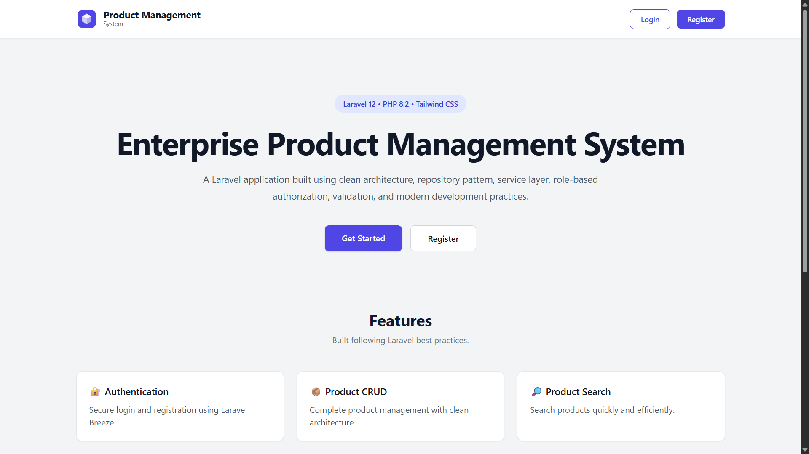
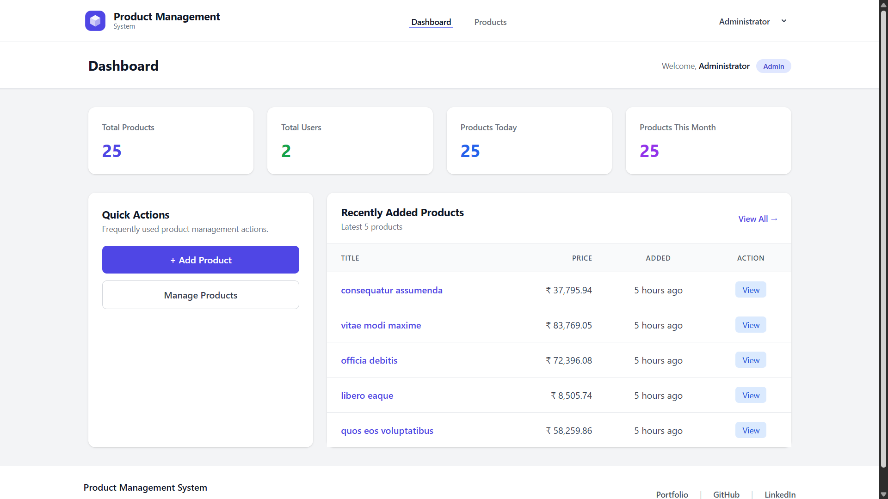
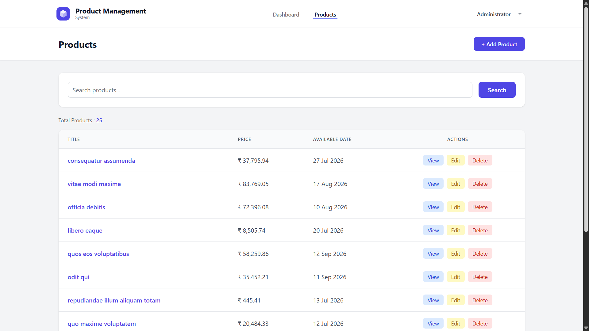
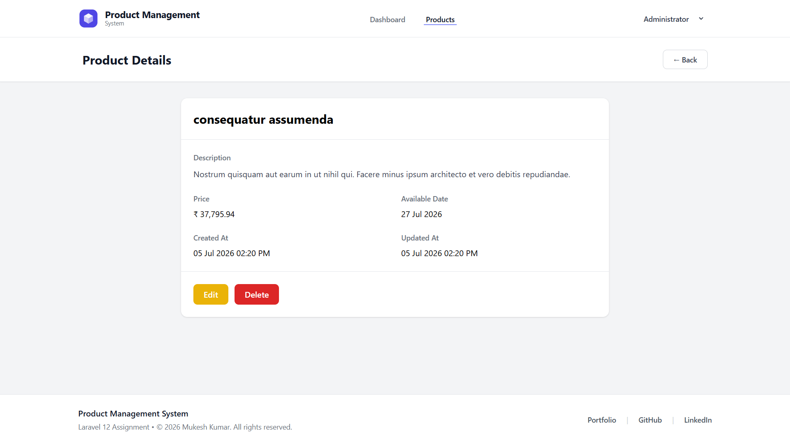
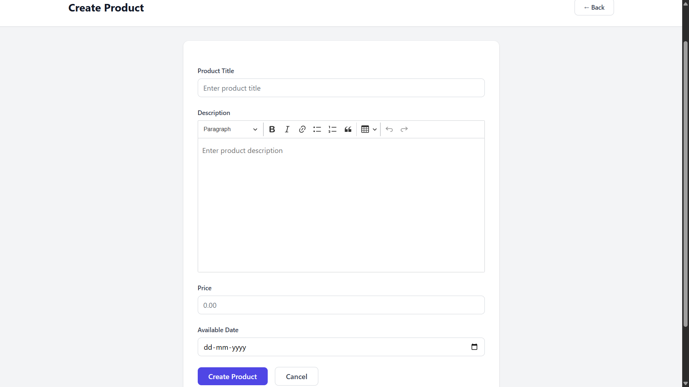

# Product Management System

A modern **Product Management System** built with **Laravel 12**, featuring authentication, role-based authorization, product CRUD operations, search, pagination, rich text editing, and a responsive user interface.

The application follows Laravel best practices by implementing a **Service Layer**, **Repository Pattern**, **Form Requests**, **Policies**, and clean architecture to ensure maintainability, scalability, and readability.

---

## Features

- User Authentication (Laravel Breeze)
- Role-Based Authorization (Admin & User)
- Dashboard with Product Statistics
- Product CRUD Operations
- Product Search
- Pagination
- Rich Text Editor (CKEditor 5)
- Form Validation using Form Requests
- Authorization using Laravel Policies
- Repository Pattern
- Service Layer Architecture
- Responsive Design using Tailwind CSS
- Custom Error Pages (403, 404, 500)
- Deployment Automation with Bash Script

---

## Screenshots

### Landing Page



### Dashboard



### Products



### Product Details



### Create Product



---

## Tech Stack

- Laravel 12
- PHP 8.2
- MySQL
- Blade
- Tailwind CSS
- Laravel Breeze
- CKEditor 5
- Vite
- Bash
- Pest
- Git & GitHub

---

## Requirements

- PHP 8.2 or later
- Composer
- Node.js & npm
- MySQL
- Git

---

## Installation

### Clone the Repository

```bash
git clone https://github.com/thappamkkumar/product-management-system.git

cd product-management-system
```

---

## Option 1: Automated Setup (Recommended)

Run the deployment script:

```bash
bash deploy.sh
```

The deployment script automatically:

- Creates the `.env` file (if it does not exist)
- Installs Composer dependencies
- Installs Node.js dependencies
- Generates the application key
- Runs database migrations
- Optionally seeds the database
- Builds frontend assets
- Optimizes the Laravel application

---

## Option 2: Manual Setup

### Install PHP Dependencies

```bash
composer install
```

### Create Environment File

```bash
cp .env.example .env
```

### Configure Database

Update your database credentials inside the `.env` file.

### Generate Application Key

```bash
php artisan key:generate
```

### Install Frontend Dependencies

```bash
npm install
```

### Run Database Migrations

```bash
php artisan migrate
```
### (Optional) Seed the Database

To create the default administrator account and sample data, run:

```bash
php artisan db:seed
```

### Build Frontend Assets

```bash
npm run build
```

### Start Development Server

```bash
php artisan serve
```

Visit:

```
http://127.0.0.1:8000
```

---

## Default Login Credentials

Available after running the database seeder.

| Role | Email | Password |
|------|-------|----------|
| Administrator | admin@example.com | Admin@123 |

---

## Project Structure

```text
app/
├── Http/
│   ├── Controllers/
│   ├── Requests/
│   └── Middleware/
├── Models/
├── Policies/
├── Repositories/
└── Services/

database/
├── migrations/
└── seeders/

resources/
├── views/
├── css/
└── js/

routes/
deploy.sh
README.md
```

---

## Architecture

The application follows Laravel best practices and clean architecture principles.

- MVC Architecture
- Repository Pattern for data access
- Service Layer for business logic
- Form Requests for validation
- Policies for authorization
- Eloquent ORM
- Blade Templating Engine
- Dependency Injection
- SOLID Principles

---

## Deployment

The project includes a Bash deployment script (`deploy.sh`) that automates the complete setup process.

The script performs the following tasks:

- Verifies required tools (PHP, Composer, Node.js, npm)
- Detects the Laravel project
- Creates the `.env` file if it does not exist
- Installs Composer dependencies
- Installs Node.js dependencies
- Generates the application key
- Runs database migrations
- Optionally seeds the database
- Builds frontend assets
- Optimizes the Laravel application

Run the deployment script:

```bash
bash deploy.sh
```


---

## Testing

The project includes automated tests to verify core application functionality.

Run the test suite using:

```bash
php artisan test
```

The test suite covers:

- Authentication
- Product CRUD functionality
- Authorization
- Database interactions


---

## Architecture Decisions

The application follows a layered architecture to improve maintainability, scalability, and testability.

### Repository Pattern
The Repository Pattern abstracts database operations from the business logic. This keeps controllers and services independent of Eloquent, making future changes easier.

### Service Layer
Business logic is implemented inside services rather than controllers. Controllers are responsible only for handling HTTP requests and responses.

### Form Requests
Validation is handled using Laravel Form Requests, keeping controllers clean and ensuring reusable validation rules.

### Policies
Authorization is implemented using Laravel Policies to enforce role-based access control for product operations.

### MVC Architecture
The project follows Laravel's MVC architecture, separating presentation, business logic, and data access responsibilities.

---

## Challenges & Solutions

### Role-Based Authorization

**Challenge**

Different permissions were required for administrators and regular users.

**Solution**

Laravel Policies were implemented to centralize authorization logic and ensure users can only perform actions they are permitted to access.

---

### Clean Code Organization

**Challenge**

Business logic inside controllers becomes difficult to maintain as the application grows.

**Solution**

Business logic was moved into a dedicated Service Layer while database operations were abstracted using the Repository Pattern.

---

### Responsive Data Tables

**Challenge**

Product tables overflowed on smaller screens.

**Solution**

Responsive containers with horizontal scrolling were implemented to ensure usability across mobile and desktop devices.

---

### Deployment Automation

**Challenge**

Manual project setup requires multiple repetitive commands.

**Solution**

A Bash deployment script was created to automate dependency installation, environment configuration, migrations, asset building, and optimization.


---


## Security & Performance

### Security

- Authentication using Laravel Breeze.
- Authorization using Laravel Policies.
- Form Request validation for all user inputs.
- CSRF protection provided by Laravel.
- Password hashing using Laravel's built-in hashing mechanism.
- Eloquent ORM used to prevent SQL injection.
- Environment variables stored securely using the `.env` file.

### Performance

- Database indexing on frequently queried columns to improve search and filtering performance.
- Pagination implemented to avoid loading unnecessary records.
- Product search optimized using Eloquent query filtering.
- Laravel optimization commands included in the deployment script.
- Vite used for efficient frontend asset bundling.
- Service Layer and Repository Pattern improve maintainability and scalability.

---

## Future Improvements

If this project were expanded into a production SaaS application, the following enhancements would be implemented:

- REST API for third-party integrations.
- Product image upload and cloud storage.
- Redis caching for improved performance.
- Queue-based background job processing.
- Docker and CI/CD pipeline. 
- Advanced search and filtering.
- Increased automated test coverage.
  

---

## Author

**Mukesh Kumar**

- 🌐 Portfolio: https://mukeshkumar.vercel.app/
- 💻 GitHub: https://github.com/thappamkkumar
- 🔗 LinkedIn: https://www.linkedin.com/in/engineer-mukesh-kumar/

---

## License

This project was developed as part of a Laravel technical assignment and is intended for educational and demonstration purposes.